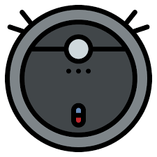

# Jeedom plugin for iRobot

This is a plugin for the Jeedom (<https://www.jeedom.com>) open source (<https://github.com/jeedom>) home automation system.

It will permit to control the iRobot Roomba & Braava robot from your Jeedom.

Documentation: <https://mips2648.github.io/jeedom-plugins-docs/dreame>

